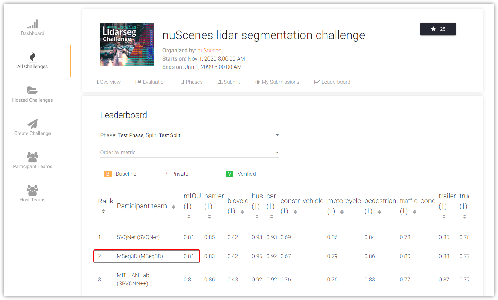

# LiDARSeg3D

A repository for LiDAR 3D semantic segmentation in autonomous driving scenarios. 

Also the official implementations of our ECCV 2022 paper (Self-Distillation for Robust LiDAR Semantic Segmentation in Autonomous Driving) and CVPR 2023 paper (MSeg3D: Multi-modal 3D Semantic Segmentation for Autonomous Driving).

## News

<!-- - [2022-07-14] Initial release for the implementation of SDSeg3D.   -->

- [2023-03-28] Our LiDAR-Camera based method MSeg3D (MSeg3D: Multi-modal 3D Semantic Segmentation for Autonomous Driving) is accepted at CVPR 2023. The [paper](https://arxiv.org/abs/2303.08600), [supplementary material](https://drive.google.com/file/d/12jN0cEH4zSwgArUaMF6HW1HC-eJnEM6p/view?usp=sharing), and code are available.

- [2022-07-19] Our method (MSeg3D) ranks 2nd on the official nuScenes lidar-seg leaderboard and achieves 81.1 mIoU with slight differences among the highly competitive Top3 submissions.

  

- [2022-07-04] Our LiDAR-only method SDSeg3D (Self-Distillation for Robust LiDAR Semantic Segmentation in Autonomous Driving) is accepted as a poster paper at ECCV 2022. [Paper](https://link.springer.com/content/pdf/10.1007/978-3-031-19815-1_38.pdf?pdf=inline%20link).

- [2022-06-20] Our multi-modality solution for 3D semantic segmentation won the 2nd place in the 3D semantic segmentation track of CVPR 2022 Waymo Open Dataset Challenges. 

<!-- ## Contact
Any questions or suggestions are welcome! 

Jiale Li [jialeli@zju.edu.cn](mailto:jialeli@zju.edu.cn) (ZJU), and
Hang Dai [hang.dai.cs@gmail.com](mailto:hang.dai.cs@gmail.com) (MBZUAI) -->

## Highlights

- **Simple:** Modules and pipelines can be instantiated via cfg files like [mmsegmentation](https://github.com/open-mmlab/mmsegmentation), but more easily applicable to LiDAR 3D point clouds for voxelization, sparse convolution, devoxelization, etc. 

- **Extensible**: Simple replacement and integration for any network components in your novel algorithms. Smooth compatibility for 3D object detector such as [CenterPoint](https://github.com/tianweiy/CenterPoint), since we try our best to preserve the features inherited from [CenterPoint](https://github.com/tianweiy/CenterPoint). 

- **Fast and Accurate**: Accelerated by 3D sparse convolution with top performance achived on SemantiKITTI, nuScenes, and Waymo benchmarks. 

- **Support for multiple datasets and multimodality**: SemanticKITTI，nuScenes and Waymo datasets. LiDAR point cloud and multi-camera images.

# Methods
## MSeg3D
> [**MSeg3D: Multi-modal 3D Semantic Segmentation for Autonomous Driving**](https://arxiv.org/abs/2303.08600)            
> Jiale Li, Hang Dai, Hao Han, and Yong Ding       

## SDSeg3D
> [**Self-Distillation for Robust LiDAR Semantic Segmentation in Autonomous Driving**](https://link.springer.com/content/pdf/10.1007/978-3-031-19815-1_38.pdf?pdf=inline%20link)            
> Jiale Li, Hang Dai, and Yong Ding        
 

## Use LiDARSeg3D

### Installation
Please follow [INSTALL](docs/INSTALL.md) to set up libraries needed for distributed training and sparse convolution.

### Benchmark Evaluation and Training 
Please refer to [GETTING_START](docs/GETTING_START.md) to prepare the data in advance. Then follow the instruction there to play with the segmentation configurations included in [configs](configs).

# Acknowlegement
This project is mainly constructed on [CenterPoint](https://github.com/tianweiy/CenterPoint) as well as multiple great opensourced codebases. We list some notable examples below. 

* [CenterPoint](https://github.com/tianweiy/CenterPoint)
* [PointAugmenting](https://github.com/VISION-SJTU/PointAugmenting)
* [mmsegmentation](https://github.com/open-mmlab/mmsegmentation)
* [mmdetection](https://github.com/open-mmlab/mmdetection)
* [OpenPCDet](https://github.com/open-mmlab/OpenPCDet)
* [Cylinder3D](https://github.com/xinge008/Cylinder3D)
* [det3d](https://github.com/poodarchu/det3d)
* [second.pytorch](https://github.com/traveller59/second.pytorch)
* [mmcv](https://github.com/open-mmlab/mmcv)

# Citation
    @inproceedings{mseg3d_cvpr2023,
    author    = {Jiale Li and
                Hang Dai and
                Hao Han and
                Yong Ding},
    title     = {MSeg3D: Multi-modal 3D Semantic Segmentation for Autonomous Driving},
    booktitle = {CVPR},
    pages     = {21694--21704},
    year      = {2023},
    }

    @inproceedings{sdseg3d_eccv2022,
    author    = {Jiale Li and
                Hang Dai and
                Yong Ding},
    title     = {Self-Distillation for Robust {LiDAR} Semantic Segmentation in Autonomous Driving},
    booktitle = {ECCV},
    pages     = {659--676},
    year      = {2022},
    }
